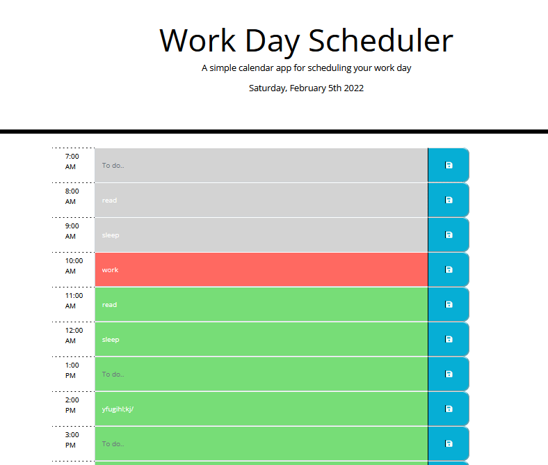

# calendarApp

This program presents a basic daily planner. 
There are time slots from 7:00 AM to 10:00 PM, where the user may enter text. 
When the save button is clicked, the text in the corresponding text is stored to local memory and will persist if the page is refreshed. 
At the the top of the page is the date, and the ongoing hour is highlighted in red, while passed and coming are in grey and green. As soon as the next hour arrives, the colors adjust. 
 
   
 Please find the deployed program at the link below: 
<a href="https://nialvo.github.io/calendarApp/">Code Quiz</a>
  
 For all inquiries, please email me via the link below: 
 <a href = "mailto: pilibili@protonmail.com">Send Email</a> 

